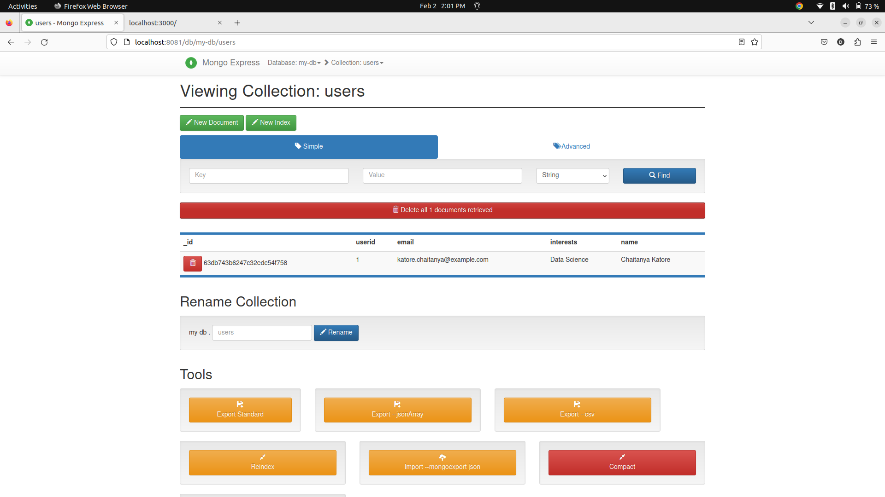

# Web Application Deployment Using Docker

In this project I have taken a Web Application which is made of:
1. HTML.
2. JavaScript.

The Application uses Node.js for the server.

In this project I make a connection between the Web Application and MonogoDB for database using Docker on the local host server.
This application is a simple personal profile application in which you can update information as many time as you want and the updates will remains as it is after refreshing the page and the last information present befor update will be store in the MonogoDB database.
I deployed the application and Monogo-express on the local host.
I create mongo.yaml file of MonogoDB and Monogo-express for deployement on local host and runnig the container.
I also created docker image using Dockerfile its for easyness using this image you do all this process in one click.
Requirements:
1. YMAL language.
2. Docker commands.

Snapshots of the project are as below:

